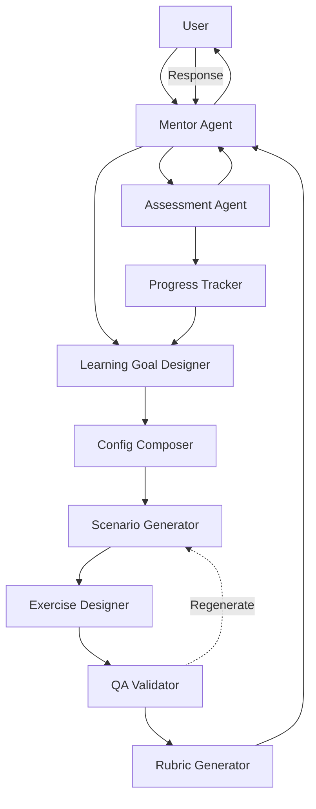

# MetaUX Core Agent Architecture

## Core Framework Agents

### 1. Mentor Agent (Orchestrator)

#### Overview
The Mentor Agent is the primary user-facing agent and the central coordinator of the entire learning experience. It acts as the "Hub" in the platform's "Hub-and-Spoke" architecture, managing all user interactions and orchestrating the agent network.

#### Core Responsibilities
- **User Interaction:** Manages the conversation with the user, providing encouragement, guidance, and contextual feedback
- **Orchestration:** Loads and executes appropriate workflow recipes based on the user's current training mode (Dojo, Unicorn Path, etc.)
- **Session Management:** Maintains session continuity, tracks user progress, ensures consistent personality
- **Synthesis:** Combines outputs from various specialist agents into coherent responses
- **Adaptive Communication:** Adjusts transparency and complexity based on user level

#### Key Attributes
- **Personality:** Encouraging but challenging, uses Socratic questioning to guide learning
- **Communication:** Structured JSON responses for UI (can support text or voice)
- **Primary Goal:** Coordinate the agent network to deliver personalized, effective learning paths

#### Interfaces With
- All other agents (hub role)
- User interface layer
- Progress tracking database

---

### 2. Learning Goal Designer

#### Overview
Formerly "Context DNA Analyst," this agent determines what competencies to train next based on user progress, pattern rules, and pedagogical principles. It embodies the system's intelligence about learning progression.

#### Core Responsibilities
- **Competency Selection:** Choose next competencies based on user performance and readiness
- **Difficulty Calibration:** Determine appropriate challenge level for user's current state
- **Pattern Rule Application:** Apply clustering, universality, and role-based rules
- **Learning Path Optimization:** Balance variety, progression, and user engagement
- **Prerequisite Checking:** Ensure foundational competencies before advanced ones

#### Key Attributes
- **Intelligence:** Uses breadcrumb rules + user data to make pedagogically sound choices
- **Adaptability:** Adjusts to user's learning velocity and struggle patterns
- **Primary Goal:** Create optimal learning progression that builds expertise systematically

#### Interfaces With
- Progress Tracker (reads user state)
- Config Composer (sends competency selections)
- Mentor Agent (receives learning requests)

---

### 3. Config Composer

#### Overview
Translates high-level learning goals into detailed scenario configurations. This agent bridges the gap between pedagogical intent and technical implementation, creating the "recipe" for scenario generation.

#### Core Responsibilities
- **Configuration Assembly:** Combine competencies, variables, and difficulty into coherent configs
- **Variable Selection:** Choose appropriate context and constraint variables
- **Hierarchical Structuring:** Organize primary, secondary, and background competencies
- **Weight Calculation:** Apply modifiers based on variables and rules
- **Compatibility Checking:** Ensure no conflicting elements in configuration

#### Key Attributes
- **Precision:** Creates detailed, unambiguous configurations
- **Coherence:** Ensures all elements work together logically
- **Primary Goal:** Transform abstract learning goals into concrete generation instructions

#### Interfaces With
- Learning Goal Designer (receives goals)
- Scenario Generator (sends configs)
- Exercise Designer (provides competency context)

---

### 4. Scenario Generator

#### Overview
Creates realistic UX scenarios with embedded pattern recognition challenges. This agent transforms configurations into rich, contextual narratives that serve as the foundation for exercises.

#### Core Responsibilities
- **Narrative Creation:** Generate realistic UX situations based on configuration
- **Pattern Embedding:** Ensure specified competency patterns are present
- **Context Application:** Apply industry, company, and role variables naturally
- **Constraint Integration:** Weave constraints into scenario organically
- **Distractor Addition:** Include realistic noise without obscuring patterns

#### Key Attributes
- **Creativity:** Generates diverse, engaging scenarios
- **Fidelity:** Maintains realism and professional authenticity
- **Primary Goal:** Create scenarios that effectively embed intended patterns

#### Interfaces With
- Config Composer (receives configuration)
- QA Validator (sends scenarios for validation)
- Exercise Designer (provides base content)

---

### 5. Exercise Designer

#### Overview
Converts scenarios into interactive exercises by selecting appropriate training mechanics and structuring content for specific interaction patterns. This agent bridges narrative scenarios and user interactions.

#### Core Responsibilities
- **Mechanic Selection:** Choose optimal training mechanic based on competency and difficulty
- **Content Structuring:** Format scenario for chosen mechanic (binary, ranking, synthesis, etc.)
- **Interaction Design:** Generate mechanic-specific elements (options, categories, prompts)
- **Time Setting:** Define appropriate time limits for exercise completion
- **Instruction Creation:** Provide clear, mechanic-specific instructions

#### Key Attributes
- **Pedagogical Awareness:** Knows which mechanics best train which patterns
- **Structural Precision:** Creates well-formed exercises for each mechanic type
- **Primary Goal:** Transform scenarios into effective interactive learning experiences

#### Mechanic Expertise
```yaml
mechanic_selection:
  signal_vs_noise: [binary_recognition, red_flag_detection]
  behavioral_consistency: [pattern_detection, sequence_recognition]
  constraint_recognition: [trade_off_analysis, constraint_optimization]
  power_dynamics: [scenario_response, prediction_challenge]
  quality_recognition: [binary_recognition, ranking, gap_identification]
```

#### Interfaces With
- Scenario Generator (receives scenarios)
- QA Validator (sends structured exercises)
- Rubric Generator (provides exercise structure)

---

### 6. QA Validator

#### Overview
Validates that generated scenarios and exercises contain the intended patterns and are assessable. This agent ensures quality and fairness before content reaches users.

#### Core Responsibilities
- **Pattern Verification:** Confirm intended patterns are actually present
- **Fidelity Assessment:** Measure how well output matches configuration intent
- **Assessability Check:** Ensure exercise can be fairly evaluated
- **Regeneration Decision:** Determine if content needs regeneration or adjustment
- **Quality Reporting:** Document validation results for system improvement

#### Key Attributes
- **Thoroughness:** Checks multiple quality dimensions
- **Objectivity:** Applies consistent validation criteria
- **Primary Goal:** Ensure all training content meets quality standards

#### Validation Thresholds
- **<50% fidelity:** Trigger regeneration
- **50-70% fidelity:** Flag for adjustment or educational opportunity
- **70-85% fidelity:** Approve with minor notes
- **>85% fidelity:** Full approval

#### Interfaces With
- Scenario Generator (requests regeneration if needed)
- Exercise Designer (validates exercise structure)
- Rubric Generator (provides validation report)

---

### 7. Rubric Generator

#### Overview
Creates dynamic assessment criteria based on what patterns are actually present in the validated exercise. This ensures fair evaluation aligned with actual content rather than intended content.

#### Core Responsibilities
- **Rubric Creation:** Generate assessment criteria from validation results
- **Success Definition:** Define what constitutes excellent/good/poor recognition
- **Mechanic Alignment:** Create rubrics appropriate for exercise mechanic
- **Difficulty Adjustment:** Calibrate expectations based on actual difficulty
- **Partial Credit Rules:** Define how to handle incomplete recognition

#### Key Attributes
- **Fairness:** Creates criteria based on what's actually assessable
- **Flexibility:** Adapts to validation findings
- **Primary Goal:** Enable accurate, fair assessment of user performance

#### Rubric Types
- **Binary Mechanics:** Clear right/wrong criteria
- **Ranking Mechanics:** Weighted scoring for order accuracy
- **Synthesis Mechanics:** Quality indicators for open responses
- **Scenario Response:** Multi-dimensional evaluation criteria

#### Interfaces With
- QA Validator (receives validation report)
- Assessment Agent (provides rubric)
- Mentor Agent (sends complete package)

---

### 8. Assessment Agent

#### Overview
Evaluates user responses against rubrics to measure pattern recognition performance. This agent provides the critical feedback loop for learning progression.

#### Core Responsibilities
- **Response Evaluation:** Analyze user answers against rubric criteria
- **Score Calculation:** Compute performance metrics for competency progress
- **Feedback Generation:** Create specific, actionable feedback
- **Pattern Analysis:** Identify what user recognized vs. missed
- **Progress Updates:** Calculate competency mastery changes

#### Key Attributes
- **Analytical Precision:** Accurate evaluation of pattern recognition
- **Constructive Feedback:** Helpful, specific guidance for improvement
- **Primary Goal:** Provide accurate assessment that drives learning

#### Assessment Strategies
- **Keyword Matching:** For gap identification and synthesis
- **Order Accuracy:** for ranking and sequence exercises
- **AI Reasoning Analysis:** For complex scenario responses
- **Pattern Completeness:** For detection exercises

#### Interfaces With
- Rubric Generator (receives criteria)
- Progress Tracker (sends performance data)
- Mentor Agent (provides feedback)

---

### 9. Progress Tracker

#### Overview
Maintains comprehensive user state including competency mastery levels, learning history, and performance patterns. This agent enables continuity and personalization across sessions.

#### Core Responsibilities
- **State Management:** Track all competency mastery levels
- **History Recording:** Store all scenarios, responses, and assessments
- **Pattern Recognition:** Identify user's learning patterns and struggles
- **Velocity Calculation:** Measure learning speed and adaptation needs
- **Readiness Assessment:** Determine when user ready for new challenges

#### Key Attributes
- **Persistence:** Maintains complete user journey
- **Analytics:** Derives insights from performance data
- **Primary Goal:** Enable personalized, continuous learning progression

#### Data Tracked
- Competency mastery (0-1 scale per micro-competency)
- Exercise history (scenarios, responses, scores)
- Learning velocity (improvement rate)
- Struggle patterns (repeated failures)
- Time investment (per competency/exercise)

#### Interfaces With
- Assessment Agent (receives performance updates)
- Learning Goal Designer (provides user state)
- Mentor Agent (supplies progress summaries)

---

## Agent Communication Flow



---

## Deferred Agents (Post-MVP)

These agents were identified but should be implemented after core framework validation:

### Design Decision Specialist Agent
**Original Purpose:** Generate strategic design choice scenarios  
**Why Deferred:** Design Decision mode is a future training mode, not core framework  
**Future Role:** Create design-specific scenarios for designer-focused products  
**Implementation Timing:** After validating core pattern recognition training

### Design Requirements Specialist Agent
**Original Purpose:** Generate tactical requirement specification exercises  
**Why Deferred:** Too specific for platform-agnostic framework  
**Future Role:** Support specialized product management training  
**Implementation Timing:** As part of role-specific training products

### Stakeholder Dynamics Simulator
**Original Purpose:** Create live complexity navigation scenarios  
**Why Deferred:** Requires sophisticated multi-agent conversations  
**Future Role:** Enable advanced organizational dynamics training  
**Implementation Timing:** After mastering single-agent scenarios

### Visual Design Evaluator
**Original Purpose:** Assess visual design competencies  
**Why Deferred:** Visual design explicitly out of scope for MVP  
**Future Role:** Extend framework to design craft skills  
**Implementation Timing:** Potential future framework expansion

---

## Implementation Priority

### Phase 1 (MVP - Essential)
1. **Mentor Agent** - User interface and orchestration
2. **Scenario Generator** - Content creation
3. **Exercise Designer** - Mechanic selection and structuring
4. **QA Validator** - Quality assurance
5. **Assessment Agent** - User evaluation

### Phase 2 (Enhancement)
6. **Learning Goal Designer** - Smart progression
7. **Config Composer** - Complex configurations
8. **Rubric Generator** - Dynamic assessment criteria

### Phase 3 (Optimization)
9. **Progress Tracker** - Advanced analytics and personalization

---

## Key Design Principles

1. **Single Responsibility:** Each agent has one clear, well-defined role
2. **Platform Agnostic:** No UI/UX implementation specifics in core agents
3. **Composable:** Agents can be upgraded or replaced independently
4. **Validatable:** Each agent's output can be verified by the next agent
5. **Extensible:** New agents can be added without disrupting existing ones
6. **Pedagogically Sound:** Every agent decision guided by learning principles

---

## System Qualities

### Robustness
- QA Validator ensures content quality
- Regeneration capability for failed generations
- Graceful degradation through fidelity thresholds

### Fairness
- Dynamic rubrics based on actual content
- Multiple assessment strategies for different mechanics
- Transparent difficulty adjustments

### Adaptability
- Learning Goal Designer responds to user progress
- Exercise Designer selects optimal mechanics
- Mentor adjusts transparency by user level

### Scalability
- Agent architecture supports parallel processing
- Modular design enables distributed deployment
- Clear interfaces support team development

---

*This architecture provides a complete, pedagogically-sound pipeline from learning goal identification through content generation, validation, and assessment, with each agent playing a crucial, well-defined role in the learning experience.*